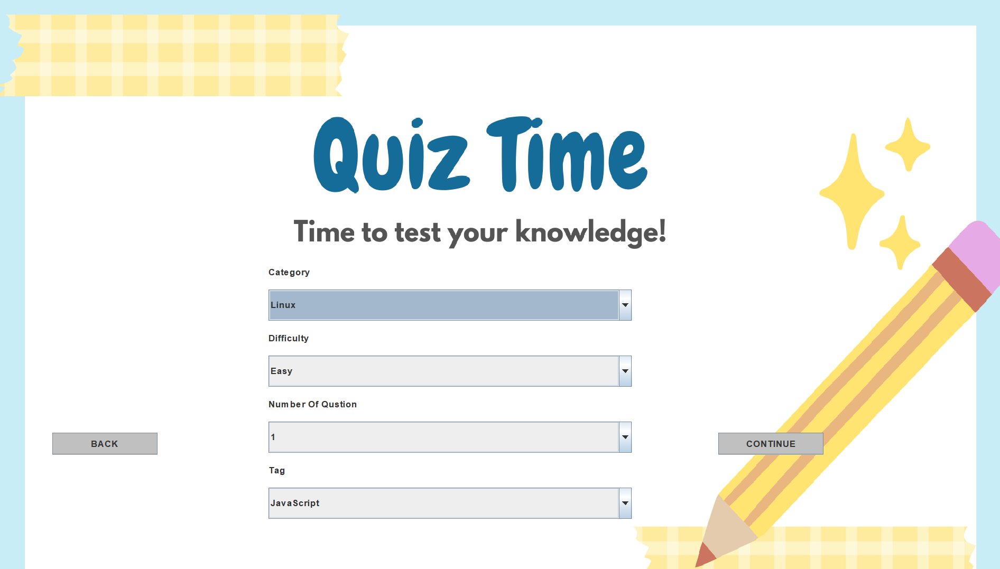
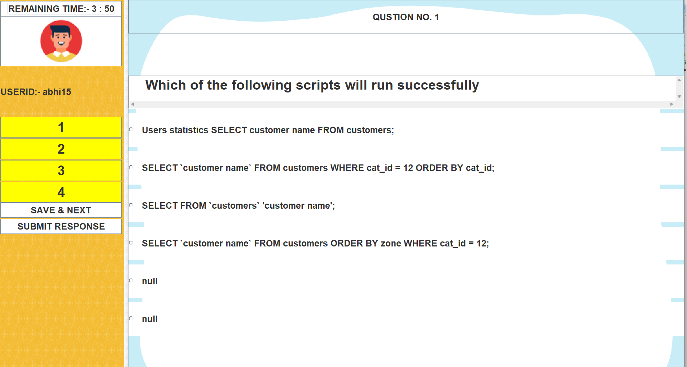
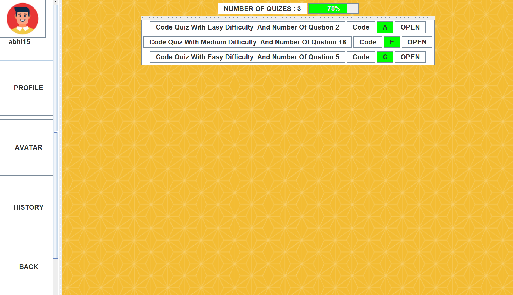
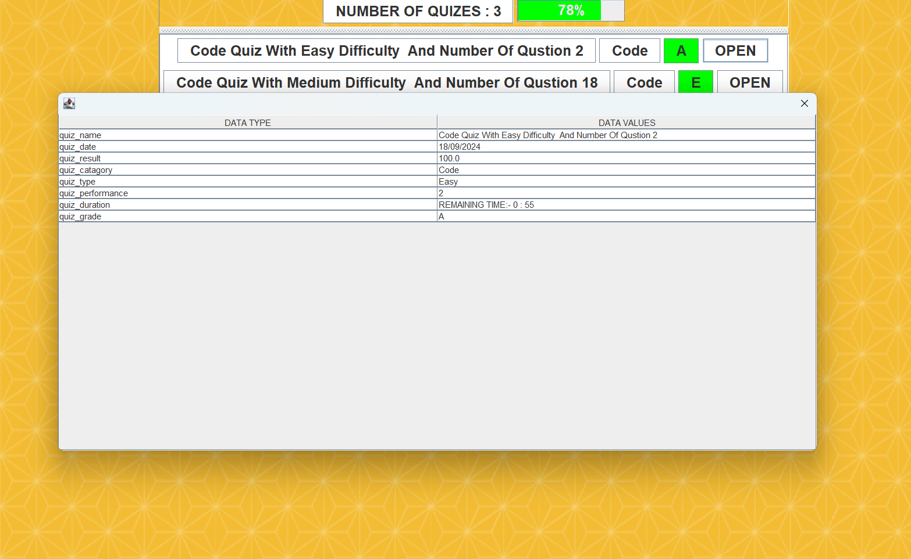

# 🎓 EduQuizMaster(TechTriviaQuiz) — Real-Time Java Quiz App

**EduQuizMaster(TechTriviaQuiz)** is a Java desktop application built with JavaFX and Swing, designed to help users prepare for trending topics through real-time quizzes. With category-based question selection, timed challenges, and detailed result tracking, it’s a complete learning and testing companion.

---

## ✨ Key Features

- 🧑‍💻 **User Authentication**
  - Login with email, user ID, and password
  - Edit profile, avatar, and personal details

- 📚 **Category-Based Quiz Selection**
  - Choose from trending topics and start a timed quiz
  - Questions sourced from real-time educational APIs

- ⏱️ **Timed Questions**
  - Each question has a 1-minute timer
  - Encourages quick thinking and time management

- 📊 **Result Analytics**
  - Displays score, percentage, correct/incorrect answers
  - Tracks quiz history and time taken per question

- 🔄 **Learning Mode**
  - Review questions and answers post-quiz
  - Learn from mistakes and improve accuracy

---

## 🖼️ Visual Preview

### 🔐 Login Window

  
*Secure login with user credentials.*

---

### 📂 Category Selection

  
*Choose your quiz topic and begin the challenge.*

---

### 📝 Quiz Window

  
*Answer timed questions with a clean, responsive interface.*

---

### 🏁 Result Summary

  
*View your score, accuracy, and performance breakdown.*

---

### 📈 Quiz History

  
*Track your past quizzes, timing, and improvement.*

---

## 🛠️ Tech Stack

| Layer       | Technology         |
|-------------|---------------------|
| UI          | JavaFX, Swing       |
| Backend     | Java                |
| API         | Real-time Education API |
| Auth        | Custom Java Auth Logic |

---

## 🚀 Getting Started

To run locally:

```bash
# Clone the repository
git clone https://github.com/abhi041540/EduQuizMaster.git
cd EduQuizMaster

# Compile and run
javac Main.java
java Main
